World Bank Gini Index
==============================

Analysis of the Gini Index using data from the World Bank.

Project Organization
------------

    ├── LICENSE
    ├── Makefile           <- Makefile with commands like `make data` or `make train`
    ├── README.md          <- The top-level README for developers using this project.
    ├── data
    │   ├── external       <- Data from third party sources.
    │   ├── interim        <- Intermediate data that has been transformed.
    │   ├── processed      <- The final, canonical data sets for modeling.
    │   └── raw            <- The original, immutable data dump.
    │
    ├── docs               <- A default Sphinx project; see sphinx-doc.org for details
    │
    ├── models             <- Trained and serialized models, model predictions, or model summaries
    │
    ├── notebooks          <- Jupyter notebooks.
    │
    ├── references         <- Data dictionaries, manuals, and all other explanatory materials.
    │
    ├── reports            <- Generated analysis as HTML, PDF, LaTeX, etc.
    │   └── figures        <- Generated graphics and figures to be used in reporting
    │
    ├── requirements.txt   <- The requirements file for reproducing the analysis environment, e.g.
    │                         generated with `pip freeze > requirements.txt`
    │
    ├── setup.py           <- makes project pip installable (pip install -e .) so src can be imported
    ├── src                <- Source code for use in this project.
    │   ├── __init__.py    <- Makes src a Python module
    │   │
    │   ├── data           <- Scripts to download or generate data
    │   │   └── make_dataset.py
    │   │
    │   ├── features       <- Scripts to turn raw data into features for modeling
    │   │   └── build_features.py
    │   │
    │   ├── models         <- Scripts to train models and then use trained models to make
    │   │   │                 predictions
    │   │   ├── predict_model.py
    │   │   └── train_model.py
    │   │
    │   └── visualization  <- Scripts to create exploratory and results oriented visualizations
    │       └── visualize.py
    │
    └── tox.ini            <- tox file with settings for running tox; see tox.readthedocs.io

--------

<small>Project based on the <a target="_blank" href="https://drivendata.github.io/cookiecutter-data-science/">cookiecutter data science project template</a>. #cookiecutterdatascience</small>

## Contents

1. [Introduction](#introduction)
2. [Variables](#variables)
3. [Data Wrangling](#data-wrangling)
4. [Feature Selection and Engineering](#feature-selection-and-engineering)
5. [Preprocessing and Model selection](#preprocessing-and-model-selection)
6. [Accumulated Local Effect Plots](#accumulated-local-effects-ale)
7. [Looking at Countries](#looking-at-countries)
8. [Final thoughts](#final-thoughts-and-ideas-for-further-research)
## Introduction 

### Motivation 

Poverty and wealth inequality are significant global concerns that have far-reaching socio-economic implications. The causes, effects, and associations of income distributions in different countries are difficult to understand on a macro scale. By using data from the World Bank, this project aims to deepen that understanding and help inform both public opinion and policy. In this analysis, I mainly focused on health and education indicators. 

### What is Gini Index? 

The Gini Index, or Gini Coefficient is a measure of how close the income distribution is to perfect equality or perfect inequality. A Gini Index of 0 indicates perfect equality while a Gini Index of 100 indicates perfect inequality. 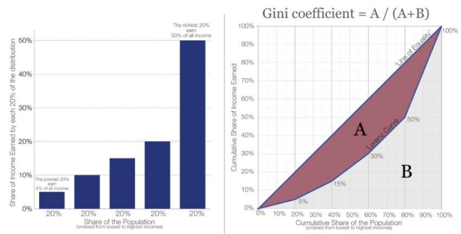

*Figure 1* 

Figure 1 shows how the Gini Index is calculated. As inequality increases, The Lorenz curve moves further out and increases area 'A'. As inequality decreases, the Lorenz curve approaches the line of equality and decreases area ‘A’. 

## Variables 

The World Bank has over[ 1400 indicators ](https://data.worldbank.org/indicator?tab=all)to choose from. The following are indicators I chose for different categories: 

### Poverty  

1. Gini Index 
1. Poverty Wealth Gap percentages below the following poverty lines[^1]  
- $2.15 a day 
- $3.65 a day 
- $6.85 a day 
3. Percentage of people living below the following poverty lines 
- $2.15 a day 
- $3.65 a day 
- $6.85 a day 

### Health 

4. Life Expectancy 
4. Number of physicians per 1000 people 
4. Number of hospital beds per 1000 people  
4. Cause of death (% of total) by 
- Communicable diseases and maternal, prenatal and nutrition conditions 
- non-communicable diseases 
- Injury 
9. Population ages 65 and above (% of total population) 

### Education 

10. Percentage of population, ages 25+, who have completed the following 
    1. Upper secondary 
    1. Short-cycle tertiary 
    1. Primary 
    1. post-secondary 
    1. Lower secondary 
    1. At least master’s or equivalent 
    1. At least bachelor’s or equivalent 
    1. Doctoral or equivalent 
10. Number of Scientific and technical journal articles published per year 

### Economy 

12. GDP (current USD) 
12. Unemployment 
12. Inflation 

[^1]: Poverty wealth gap percentage is the mean shortfall in income or consumption (counting the nonpoor as having zero shortfall), expressed as a percentage of the poverty line.

## Data Wrangling 

Each variable had its own csv file. After transforming and joining all the variables, the resulting table had *16,757* rows and *28* columns where each row represented a country at a year. While the table was vast, covering about *200* countries over the last *60* years, the data itself was sparse. The data is an amalgamation of indicators from different world organizations that measure a different set of countries at different periodicities. To tackle this issue, I first dropped features that were highly correlated and then interpolated some of the missing values by taking an average of the feature measured in the same country around those years. For example, a radius of 2 for a missing feature in Cambodia in 1995 will be filled by the average of that value in Cambodia measured from 1993 to 1997. I used a radius of *3* to yield *384* rows with *60* countries between *2002* to *2021*. As I dropped more columns while feature engineering, I was able to go back and grab more data before modelling. 

Gini Index distribution and correlations 

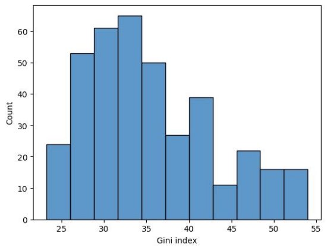

*Figure 2: The distribution of Gini Index is skewed left.* 

Correlation with Gini Index 

|Features |correlation  |
| - | :- |
|COD, by injury|  0.51 |
|Poverty headcount ratio at $6.85 | 0.33| 
|Poverty gap at $6.85 | 0.30 |
|Poverty gap at $3.65 | 0.27 |
|Poverty headcount ratio at $3.65 | 0.26| 
|Poverty gap at $2.15 | 0.25 |
|Poverty headcount ratio at $2.15 | 0.25| 
|Population, total | 0.24| 
|Inflation | 0.20 |
|GDP (current US$) | 0.08| 
|Unemployment | 0.04| 
|Year | -0.05| 
|EA, at least completed short-cycle tertiary | -0.32| 
|Life expectancy | -0.36 |
|EA, Doctoral or equivalent | -0.38| 
|GDP per capita | -0.41 |
|Physicians (per 1,000 people)|  -0.43 |
|EA, at least Master's or equivalent | -0.46| 
|COD, by non-communicable diseases | -0.48| 
|EA, at least completed primary  |-0.52 |
|Population ages 65 and above (% of total population) | -0.59| 
|Hospital beds (per 1,000 people) | -0.59 |
|EA, at least completed lower secondary | -0.62| 

*Figure 3: Feature correlations with Gini Index. You can find the entire correlation matrix at /reports/edacorr.xlsx* 
## Feature Selection and Engineering
### Principle Component Analysis for poverty related features 

Unsurprisingly, all the poverty related features were highly correlated with each other. To understand them better and use them effectively, I transformed those 6 features with PCA. 

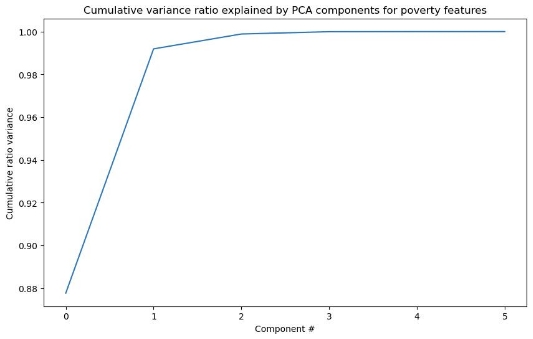

*Figure 4*

Figure 4 shows that 99% of the variance can be explained by the first 2 components. The first one explains ~88% of the variance while the second explains 11%  

|**Coefficients of the first 2 components**  |||||||
| - | :- | :- | :- | :- | :- | :- |
||Poverty headcount ratio at $3.65 |Poverty headcount ratio at $6.85 |Poverty gap at $2.15 |Poverty gap at $3.65 |Poverty headcount ratio at $2.15 |Poverty gap at $6.85 |
|0 |0\.43 |0\.38 |0\.38 |0\.43 |0\.41 |0\.42 |
|1 |-0.21 |-0.60 |0\.57 |0\.18 |0\.38 |-0.32 |

` `The first component which accounts for 88% of the variance is very similar to just taking an average of all the poverty features and scaling by 0.4  

The second component, although it only represents 12% of the variance, is more interesting. It sees great negative representation from features at $6.85/day, great positive representation from features at $2.15/day, and close to zero with $3.65/day. It seems like the second component measures the severity of poverty. If the second component is positive, there's more people at the $2.15 level than at $6.85 and vice versa if negative. 

### Using VIFs to reduce multicollinearity 

|Features |VIFs before  |VIFs after |
| - | :- | - |
|EA, at least completed primary                           |15\.46 |removed |
|COD, by non-communicable diseases                        |14\.10 |removed |
|EA, at least completed lower secondary                   |11\.01 |4\.84 |
|Population ages 65 and above (% of total population) |`  `7.62 |removed |
|Life expectancy                                           |7\.09 |5\.67 |
|poverty\_pca0                                              |5\.66 |3\.81 |
|GDP per capita                                            |4\.90 |4\.62 |
|Population, total                                         |4\.43 |4\.09 |
|Physicians (per 1,000 people)                             |4\.16 |3\.01 |
|GDP (current US$)                                         |3\.25 |3\.13 |
|COD, by injury                                            |3\.20 |1\.88 |
|Hospital beds (per 1,000 people)                          |2\.85 |2\.45 |
|EA, at least completed short-cycle tertiary               |2\.72 |2\.37 |
|EA, Doctoral or equivalent                                |2\.49 |2\.38 |
|poverty\_pca1                                              |2\.48 |2\.36 |
|Unemployment                                              |2\.46 |2\.05 |
|EA, at least Master’s or equivalent                       |2\.33 |2\.31 |
|Inflation                                                 |1\.71 |1\.56 |
|Year                                                      |1\.64 |1\.55 |

Since my goal for this model is more about interpretability and inference and less about predictive accuracy. I wanted to remove as much multi-collinearity as possible. I went with the rule of thumb to keep VIFs below 5. 

Above, you can see the VIFs for each feature before and after removal. After dropping those features, I repeated the ETL to gather more data. With the same radius, I was able to get from 384 rows in 60 countries to 429 rows with 67 countries.  

## Preprocessing and Model Selection 

The pipeline begins by standard scaling all the features. It then uses PCA on the poverty features to reduce it to two columns while letting the remaining columns ‘pass through’. 

While testing different models, I found that the variance in my results were high depending on how I split the dataset. Because of this, I used 5-fold cross-validation without splitting my already small dataset into separate testing and training sets. Furthermore, values between countries were imputed so I made sure that no two folds had the same country to avoid data leakage.  

I tested linear regression, LassoLars, KNN and XGBoost and used R-squared as my metric. Although Linear regression performed poorly, LassoLars was able to extract some insight and had an R-squared of 0.24 

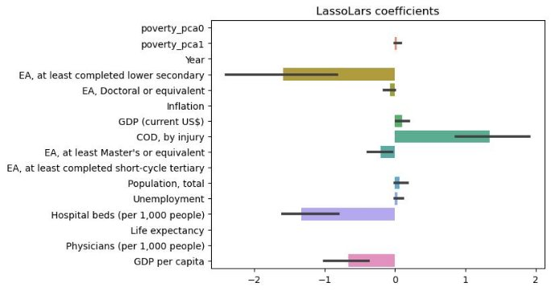

*Figure 5*

Figure 5 shows the average coefficient chosen for each feature over five folds. The black bars are confidence intervals. Since all the variables are standard scaled, coefficients can be compared directly. According to lasso the most important variables in order are: 

- Educational attainment, at least completed lower secondary, population 25+, total (%) (cumulative) 
- Cause of death, by injury (% of total) 
- Hospital beds (per 1,000 people)   
- GDP per capita 

KNN and XGBoost both performed similarly, after tuning their hyper-parameters, with R-squared(s) of 0.59 and 

0\.57 respectively. To pick the best model between the two, I looked at which model performed best with less features. I used Recursive Feature Elimination for XGBoost and Sequential Feature Selector for KNN. 

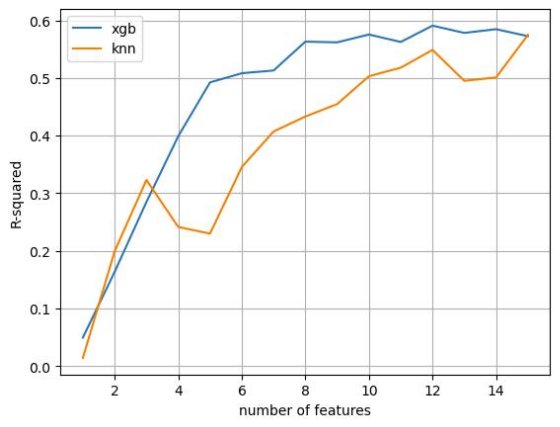

*Figure 6* 

Figure 6 shows how both models perform with less features. XGBoost clearly performs better with less features. Using Recursive feature elimination, permutation importance, trial, and error I was able reduce the model to these seven features with an average R-squared of 0.68: 

- Poverty PCA 0 (Poverty magnitude) 
- Poverty PCA 1 (Poverty severity) 
- GDP per capita 
- Educational attainment, at least completed lower secondary 
- Cause of Death, by injury (%) 
- Population, total 
- Hospital beds (per 1,000 people) 

## Feature Importance 

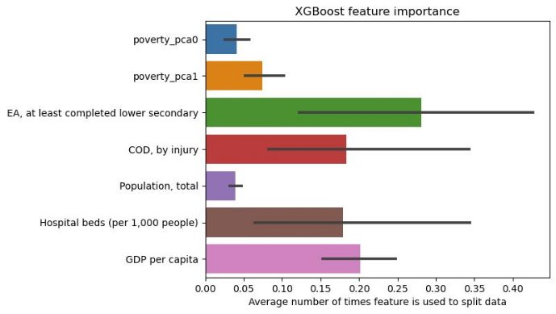

*Figure 8*

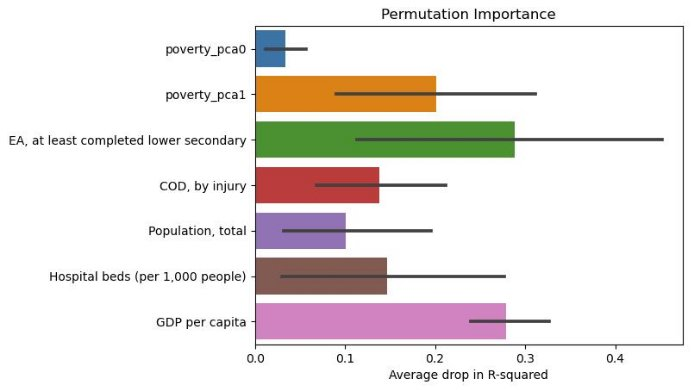

*Figure 7*

From Figure 7 and 8, it’s clear that Educational Attainment, at least completed lower secondary and GDP per capita are the 2 most important features. It’s also interesting to note that although poverty pca 1 isn’t ranked highly by XGBoost, it has a large impact on the drop in explained variance when shuffled. This shows that it may have important interactions with one or more of the other features. 

## Accumulated Local Effects (ALE) 

I used ALE plots to examine the relationship between variables and Gini Index. Accumulated local effects describe how features influence the prediction of a machine learning model on average. The y-axis can be interpreted as the difference in the features prediction from the average prediction on the data. An ALE of 2 means we can expect the Gini index to be about 2 points higher than average by having that feature value. 

ALE is calculated by first ‘slicing’ the feature of interest into even intervals. The ‘slope’, at each interval, is estimated using its data points. By taking the difference in the model’s prediction between a small increase and decrease in the variable of interest at each data point and taking an average. This slope is the local effect of the variable. Starting at the lowest value of the variable and moving up, the local effects at each interval are cumulatively added up, hence the name. The final graph is then centered to zero. This plot has the effect of estimating the partial derivative of the model with respect to the variable and then taking an indefinite integral. This helps isolate the effects of the variable alone. 

Consider a scenario where you're analyzing the factors influencing house prices. You're measuring the impact of a specific variable, let's say "area", on house prices. You slice the range of this variable into intervals and for each interval, you measure how a small change in area affects the house prices. The cumulative sum of these changes, starting from the smallest house, shows you the overall influence of area on house prices. This approach helps isolate the impact of area, allowing you to understand its effect on house prices without being confused by other factors like the location of the house 

or the year it was built. 

### Educational Attainment, at least completed secondary 

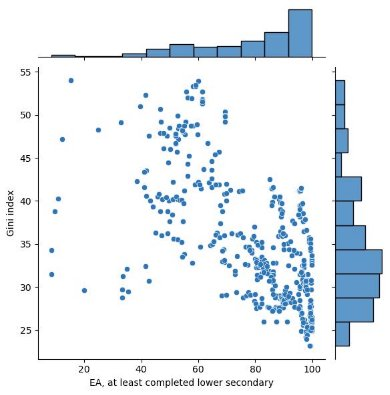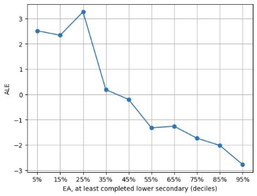

This indicator is a measure of the percentage of population ages 25 and over that attained or completed lower secondary education. Countries at higher levels are associated with a lower Gini index and lower wealth inequality. The data for education is mapped to the International Standard Classification of Education (ISCED) to ensure the 

comparability of education programs at the international level. The median value for this indicator is at 85% and the 75th percentile is at 96%. This shows that even for developed countries where this measure is high, the association is still strong and increasing the educational attainment rate could help decrease wealth inequality.  

### GDP per capita 

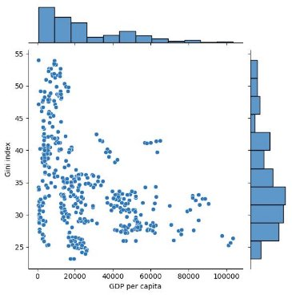 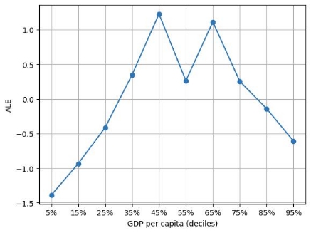

GDP per capita represents the value of all the goods and services produced by a country (GDP) divided by its population. This indicator is often used to measure the general prosperity of a country. The ALE shows that increasing GDP per capita to about the median level, increases wealth inequality. However, after that point, the trend inverses. 

### Hospital Beds (per 1,000 people) 

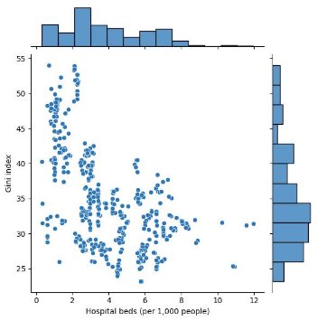 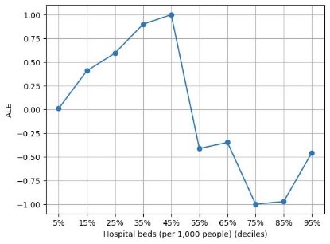

Hospital beds per 1,000 people is one of many key indicators tracked by the World Health Organization (WHO) to evaluate health systems. This feature is difficult to interpret on its own as it reflects both demand and supply side factors. For example, a low value could represent a healthy population or the inadequacy of a health system to provide enough beds. Whereas a high value could be because of an epidemic.  

### Cause of Death, by injury 

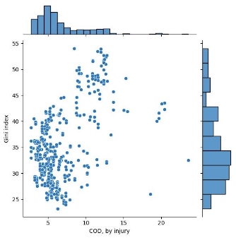 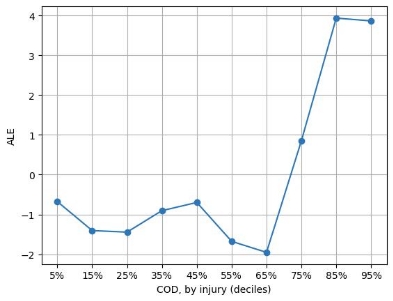

Cause of Death, by injury, refers to the percent share of all deaths for all ages by intentional or unintentional       injuries. The ALE plot seems to plateau or even decrease with this indicator until the 65th percentile mark which is about 

7\.4%. After that we see a sharp increase in the predicted Gini index. 

### Population, total

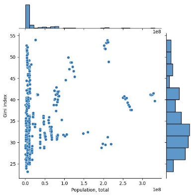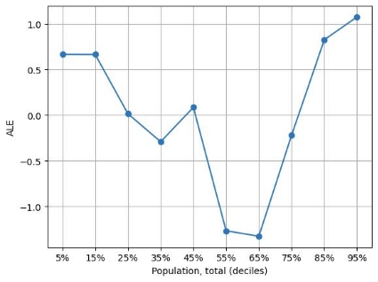

This indicator counts all residents regardless of legal status or citizenship. The ALE plot suggests that there is an optimal level of population that keeps the Gini index low. A population higher or lower than that level, increases the Gini index. That level, which seems close the 55th to 65th percentile mark, is around 11,000,000 people. 

Average level of poverty (Poverty PCA 0) 

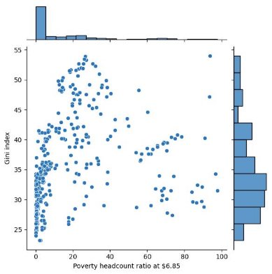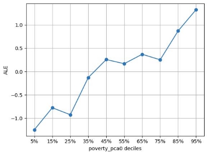

Increase in levels of poverty is correlated with an increase in Gini index and in wealth inequality. 

Severity of Poverty (Poverty PCA 1) 

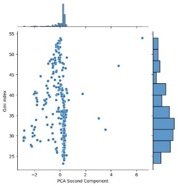 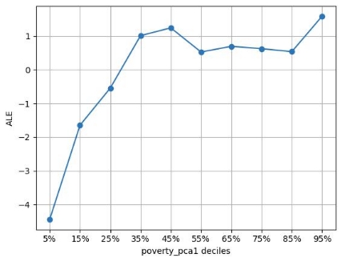

Increase in the severity of poverty is correlated with an increase in Gini index and in wealth inequality up to the 35th percentile, after which the Gini index plateaus. 

## Looking at Countries 

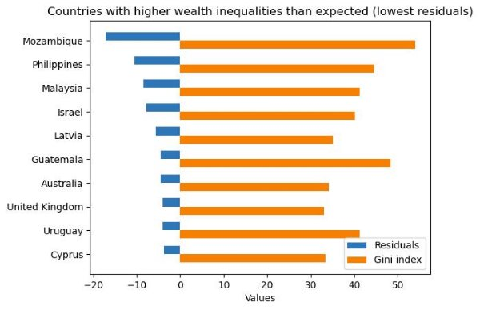

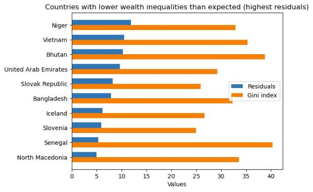

Above, we see countries where the model fails most. Analyzing these countries can give us more insight into both the model and wealth inequality. For example, Mozambique is one of the poorest countries in the world and is plagued by crime and corruption. Crime rates and corruption could have been a useful feature to include in the model. On the other hand, countries where wealth inequality is much lower than the model predicted could have useful policies or strategies that other countries can use. 

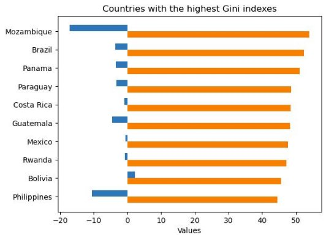

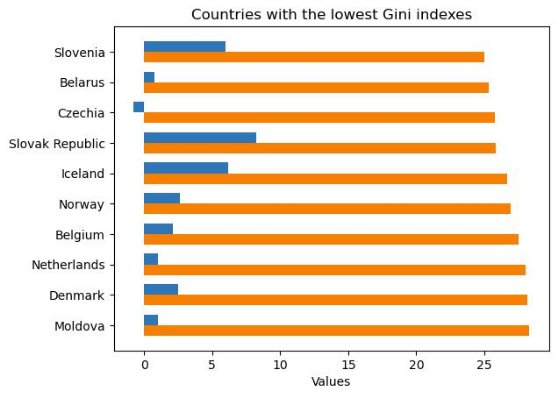

>[!NOTE]
>Keep in mind that this isn’t a world comparison. This only includes the 67 countries in my dataset. 

## Final thoughts and Ideas for Further research 

The Gini index, while widely used to gauge wealth inequality, has its limitations. Research has shown that it tends to be more sensitive to changes in the middle of the distribution than at the extremes. In future investigations, exploring wealth inequality through additional indicators would offer a more nuanced perspective. While my current analysis focuses on associations, it refrains from making strong causal claims. A potential enhancement could involve introducing a time lag between Gini index and other features. 

Contrary to a common misconception that increasing wealth inequality benefits everyone, my findings demonstrate a concerning association between rising wealth inequality and increased poverty levels and severity. The relationships observed with population and GDP per capita are intriguing, particularly given the absence of a correlation between GDP and the Gini index. Two of the health indicators, ‘Cause of Death, by injury’ and ‘Hospital beds (per 1,000 people)’ emerged as significant but presented challenges in interpretation. 

For future analyses, incorporating more variables such as political system, international trade, and crime statistics could enrich our understanding. Exploring alternative models, such as Generalized Additive Models (GAMs) widely used in econometrics, could yield valuable insights. Delving into outlier countries like Niger, Vietnam, or the Philippines would provide deeper domain knowledge. This holistic approach aims to refine our understanding of a challenge as complex and pervasive as wealth inequality. 